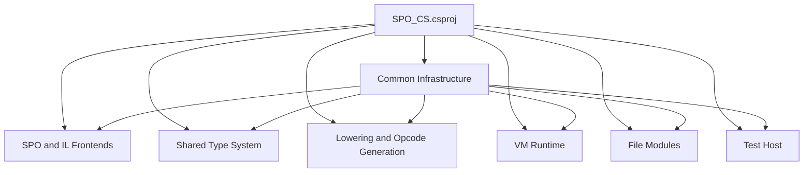
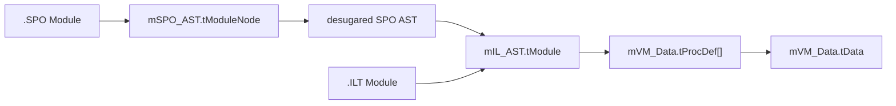

# Repo Overview

## Project Scope

`SPO_CS/SPO_CS.csproj` contains the complete system:

- `TargetFramework = net10.0`
- `LangVersion = 14.0`
- `OutputType = Exe`
- `PublishAot = true`
- `TestSrc Include="**\\*.Tests.cs"`

This matters architecturally:

- There are no project boundaries between frontend, backend, and tests.
- The layering is conceptual, not assembly-based.
- `SPO_CS/src/mRunTests.cs` is the effective entry point for all tests.

## Repo Shape Outside `SPO_CS`

`SPO_CS/` is the implementation core, but the repo also contains adapter and host projects around it:

| Path | Role |
| --- | --- |
| `SPO/` | sample executable host for `.spo` programs |
| `LSP/` | VS Code language-client packaging |
| `spo-grammar-0.1.0/` | VS Code grammar packaging |
| `TestRunner/FakeTestAdapter/` | VSTest integration for the custom `mTest` runner |
| `AI-Doc/` | secondary architecture notes checked against source |

If you are debugging parser, lowering, types, VM behavior, or modules, start in `SPO_CS/` and treat the other folders as consumers or adapters.

## Layers

| Layer | Main files | Role |
| --- | --- | --- |
| Common | `SPO_CS/src/Common/*` | Streams, results, parser infrastructure, FS, test DSL |
| SPO frontend | `mTokenizer`, `mSPO_Parser`, `mSPO_AST`, `mSPO_Desugar` | Read SPO, build AST, remove syntax sugar |
| Type analysis | `mSPO_AST_Types`, `mVM_Type` | Scope building, type inference, subtyping, type values |
| IL boundary | `mIL_AST`, `mIL_Parser` | Shared intermediate format for `.SPO` and `.ILT` |
| Lowering | `mSPO2IL`, `mIL_GenerateOpcodes` | AST to IL, IL to VM procedures |
| Runtime | `mVM_Data`, `mVM` | Values, opcodes, call stack, execution |
| Modules | `mModule`, `SPO_CS/Modules/` | File-based module assembly and dependency injection |
| Tests | `mTest`, `mRunTests`, `mRegression_Tests`, `mModule_Tests` | CLI test host and end-to-end checks |

## Main Artifacts

The hard boundary between frontend and backend is `mIL_AST.tModule`.
Below that point, `.SPO` and `.ILT` continue with the same IL model.

## Entry Points

- `mRunTests.cs`
  Starts the test tree and handles flags such as `--list`, `--matchAny`, `--plainText`, or `--stopOnFirstFail`. For file-driven regression coverage, launch it from `SPO_CS/`: the current `mRegression_Tests` implementation resolves `Regression.Tests/` from `mFS.CWD()`.
- `mSPO_Interpreter.Run(...)`
  Direct entry point for SPO source text. This route goes through parser, desugaring, type analysis, lowering, and then the VM. Before type analysis, it seeds the initial scope with the built-in `_=...` proc so that `§VAR` assignment can work as a method call.
- `mVM.Run(mIL_AST.tModule, ...)`
  Direct entry point for already parsed IL modules. The last definition of the module is the actual entry point; earlier definitions are carried as environment.
- `mModule.Init(...)`
  File-based entry point for `SPO_CS/Modules/*.SPO` and `SPO_CS/Modules/*.ILT`, including dependency assembly and `.ILT` comparison for `.SPO`.
- `SPO/src/Program.cs`
  Example embedding host for standalone `.spo` execution. It injects `_StdLib` plus `_LoadModule...` as host-side externs, then runs the returned SPO value through `mVM.Run(...)` with object `#IO ()`.

## Architectural Contracts

- `mTokenizer` is intentionally shared by `mSPO_Parser` and `mIL_Parser`.
- `mVM_Type` is not a late backend add-on; it is the shared core.
- `mSPO_Interpreter` is the orchestrator for the full SPO pipeline.
- An IL module always starts through exactly one init proc: the last def is the entry point, earlier defs live in `ENV`, and the import record lands in `ARG`.
- `mModule` builds imports as records; `§IMPORT` is pattern matching on structured module values, not just name binding.
- `SPO_CS/Modules/` and `SPO_CS/Regression.Tests/` are not documentation examples, but executable system artifacts.

## What This Repository Actually Is Today

It is not a separate "compiler next to a VM", but a tightly coupled system with these properties:

- an experimental surface language (`SPO`)
- an explicitly parseable intermediate representation (`ILT`)
- one shared type system across all phases
- a register-based execution machine
- file-based modules secured by real end-to-end tests
- sample host, editor, and test-adapter projects built around that core
