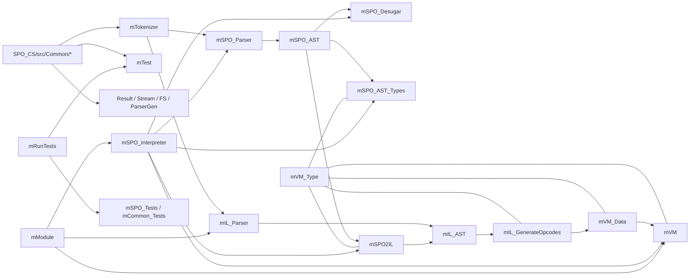

# Code Map

## Core Modules

| File | Role | Direct conceptual neighbors |
| --- | --- | --- |
| `SPO_CS/src/mTokenizer.cs` | shared lexer for SPO and IL | `mSPO_Parser`, `mIL_Parser` |
| `SPO_CS/src/mSPO_AST.cs` | surface AST for SPO | `mSPO_Parser`, `mSPO_Desugar`, `mSPO_AST_Types`, `mSPO2IL` |
| `SPO_CS/src/mSPO_Parser.cs` | parser for SPO source | `mTokenizer`, `mSPO_AST`, `mSPO_Desugar`, `mSPO2IL` |
| `SPO_CS/src/mSPO_Desugar.cs` | reduction of sugar to core forms | `mSPO_AST` |
| `SPO_CS/src/mSPO_AST_Types.cs` | type analysis and scope propagation | `mSPO_AST`, `mVM_Type` |
| `SPO_CS/src/mSPO2IL.cs` | lowering from SPO AST to IL | `mSPO_AST`, `mSPO_AST_Types`, `mIL_AST`, `mVM_Type` |
| `SPO_CS/src/mIL_AST.cs` | shared IL model | `mIL_Parser`, `mSPO2IL`, `mIL_GenerateOpcodes` |
| `SPO_CS/src/mIL_Parser.cs` | parser for `.ILT` | `mTokenizer`, `mIL_AST` |
| `SPO_CS/src/mIL_GenerateOpcodes.cs` | IL to `mVM_Data.tProcDef[]` | `mIL_AST`, `mVM_Type`, `mVM_Data` |
| `SPO_CS/src/mVM_Type.cs` | shared type core | almost all compiler and runtime phases |
| `SPO_CS/src/mVM_Data.cs` | runtime values and opcode containers | `mVM`, `mIL_GenerateOpcodes` |
| `SPO_CS/src/mVM.cs` | register-based VM | `mVM_Data`, `mIL_GenerateOpcodes` |
| `SPO_CS/src/mSPO_Interpreter.cs` | SPO end-to-end orchestrator | parser, desugar, types, lowering, VM |
| `SPO_CS/src/mModule.cs` | file-based module loader | `mSPO_Interpreter`, `mIL_Parser`, `mVM` |
| `SPO_CS/src/mRunTests.cs` | CLI test host | `mTest`, `mSPO_Tests` |

## Supporting Folders Outside `SPO_CS`

| Path | Why it exists |
| --- | --- |
| `SPO/src/Program.cs` | example host embedding of `mSPO_Interpreter` and `mVM` |
| `LSP/src/extension.js` | VS Code language-client bootstrap |
| `spo-grammar-0.1.0/` | syntax-highlighting package for `spo` |
| `TestRunner/FakeTestAdapter/` | IDE test discovery and execution bridge |

## Dependency View

## Common Infrastructure That Is Actually Central

`SPO_CS/src/Common/` is large, but for the architecture of this codebase, these modules matter most:

- `mParserGen`
  parser combinators for SPO and IL
- `mTextParser`, `mTextStream`, `mSpan`
  text and position model
- `mStream`, `mArrayList`, `mTreeMap`
  functionally flavored core containers
- `mResult`, `mMaybe`
  error and optionality model
- `mFS`
  file-based test and module paths
- `mTest`
  test tree, execution, and CLI filtering

## Recommended Onboarding Order in Code

If you want to understand the repository technically, this order is the most efficient:

1. `SPO_CS/src/mSPO_Interpreter.cs`
   shows the whole SPO pipeline compactly
2. `SPO_CS/src/mSPO_Parser.cs` and `SPO_CS/src/mSPO_AST.cs`
   show the visible language
3. `SPO_CS/src/mSPO_Desugar.cs`
   separates surface syntax from core language
4. `SPO_CS/src/mSPO_AST_Types.cs` and `SPO_CS/src/mVM_Type.cs`
   explain the actual semantics
5. `SPO_CS/src/mSPO2IL.cs` and `SPO_CS/src/mIL_AST.cs`
   show the backend boundary
6. `SPO_CS/src/mIL_GenerateOpcodes.cs`, `SPO_CS/src/mVM_Data.cs`, and `SPO_CS/src/mVM.cs`
   explain the runtime
7. `SPO_CS/src/mModule.cs` and `SPO_CS/src/mRegression.Tests.cs`
   show real artifacts and system integration

## Artifact Map

| Path | Role |
| --- | --- |
| `SPO_CS/Modules/Std.ILT` | canonical standard module directly in IL |
| `SPO_CS/Modules/Char.SPO` + `Char.ILT` | SPO module built on `Std` plus its checked canonical IL |
| `SPO_CS/Modules/Text.SPO` + `Text.ILT` | SPO module built on `Std` and `Char` plus its checked canonical IL |
| `SPO_CS/Modules/Maybe.SPO` + `Maybe.ILT` | generic SPO module plus canonical IL; module test still fails at `.tMaybe tIn` |
| `SPO_CS/Modules/Result.SPO` | existing module artifact, currently not exposed as `ModuleSetup` |
| `SPO_CS/Regression.Tests/*` | end-to-end cases for language, types, and IL |

Important distinction:

- `Std` is loaded from `.ILT` directly in `mModule`
- `Char`, `Text`, and `Maybe` are loaded from `.SPO` and checked against the sibling `.ILT`
- filesystem presence does not mean a module is registered in `mModule`

## What This Map Makes Visible

- `mVM_Type` is the central node of the system.
- `mIL_AST` is the shared boundary between both frontends and the backend.
- `mModule` intentionally sits at the very top and only uses finished end-to-end entry points.
- The test structure mirrors the architecture: from small parser and type tests up to real files and module graphs.
- the repo has thin but relevant outer layers for host embedding, editor tooling, and IDE test discovery
