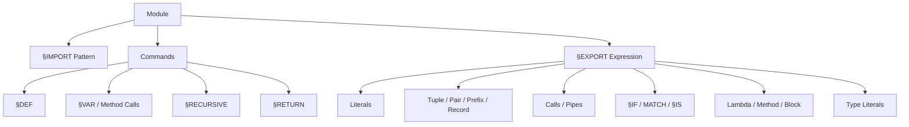
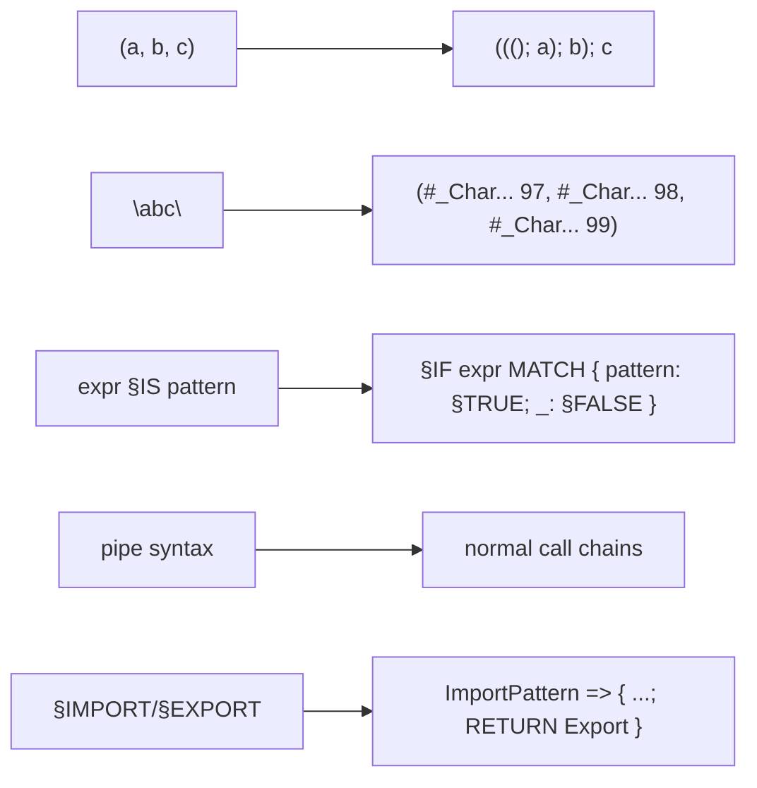

# Surface Language

## Shape

In this repository, SPO is an expression-oriented language with:

- pattern matching as a core mechanism
- algebraic data forms built from `()`, `Pair`, `Prefix`, and `Record`
- an explicit type language with recursion and generics
- file-based modules via `§IMPORT` and `§EXPORT`
- a small imperative corner through `§VAR` and methods

Many visible forms are sugar. Internally, the implementation reduces a lot of syntax to pairs, prefixes, records, normal calls, and `§IF ... MATCH`.



## Lexical Form

From `mTokenizer`:

- keywords are `§`-prefixed special ids such as `§DEF`, `§IF`, `§IMPORT`
- prefix constructors use `#`
- normal identifiers may contain `...`
- char literals are currently forms like `§a`, `§A`, `§1`, and are therefore limited to alphanumeric single characters
- strings can be single-line or multi-line

Multi-line text has this form:

```spo
"
|first line
|second line
"
```

## Module Form

A SPO module consists of:

1. optional `§IMPORT`
2. zero or more commands
3. mandatory `§EXPORT`

If `§IMPORT` is absent, the parser inserts an empty record pattern internally.

Example:

```spo
§IMPORT {
	Std: {
		...+...: §DEF ...+... € [[§INT, §INT] => §INT]
	}
}

§DEF Inc = (
	§DEF X € §INT
) => X .+ 1

§EXPORT Inc
```

Important: `§IMPORT` is a pattern, not just a name list. Modules are matched as structured values.

## Internal Names at the IL Boundary

The SPO surface does not show all internal names directly. In generated `.ILT` and in VM traces, these additional forms appear:

- module imports such as `Std:` or `Char:` become internal field names `_Std` and `_Char`
- local and bound SPO names often appear underscore-prefixed, such as `_X` or `_Char`
- compiler-generated register, def, and type names are `r_*`, `d_*`, and `t_*`

This is not a second user-facing language layer, but it is a real architectural boundary when comparing `.SPO`, `.ILT`, and runtime traces.

## Commands

The command forms implemented by the parser are:

- `Pattern = Expression`
- `§RETURN Expression`
- `§RETURN Expression IF Expression`
- `§VAR Name := Expression ... .`
- `Expression : MethodCalls .`
- `§RECURSIVE { ... }`

Examples from real tests:

```spo
{Second: §DEF x} = {First: (), Second: 1}

§VAR X := 1, + 2 .

§RECURSIVE {
	§DEF Fib = (
		§DEF n € §INT
	) => ...
}
```

### Blocks

Blocks are expressions:

```spo
{
	§RETURN 1 IF cond
	§RETURN 0
}
```

There is no implicit "last expression wins". Returns happen through explicit `§RETURN` commands.

## Expressions

### Literals

- `()`
- `§TRUE`, `§FALSE`
- integers such as `12`, `-3`, `1_000`
- chars such as `§a`
- text such as `"abc"`

### Data Forms

```spo
#Box 12
(a; b)
(a, b, c)
{ Name: "Ada", Age: 42 }
```

Semantically important:

- tuples are sugar over nested pairs
- records are internally built from prefixed fields
- text values become recursive char lists

### Calls and Operator-Style Names

SPO uses `...` inside names to create different call styles.

Examples from the repository:

- `2 .+ 5` calls `...+...`
- `k .* a` calls `...*...`
- `a .Ord` calls `...Ord`
- `3 .<= 5 <= 7` chains `...<=...<=...`

The parser helpers `Infix`, `InfixCall`, and `InfixPrefix` in `mSPO_Parser` generate these names systematically.

### Lambdas

Normal lambda:

```spo
(§DEF X € §INT) => X
```

Generic lambda:

```spo
(§DEF t € §TYPE) <=> (
	§DEF X € t
) => X
```

### Methods

Methods have an object side and an argument side:

```spo
§DEF +... = (
	§VAR X € §INT
) : (
	§DEF Y € §INT
) {
	X := ((§TO_VAL X) .+ Y).
}
```

Method calls can appear as statement-like chains and end with `.`.

### Pipes

Both directions are implemented:

```spo
Value §>.MapEachWith Mapper
.Push 3 To §< .Push 2 To §< ()
```

`mSPO_Desugar` rewrites pipes into normal calls.

### Control and Matching

If with conditions:

```spo
§IF {
	Cond1: Expr1
	Cond2: Expr2
}
```

Pattern match:

```spo
§IF Value MATCH {
	Pattern1: Expr1
	Pattern2: Expr2
}
```

`§IS` is only sugar:

```spo
Pair §IS (_, 2)
TagValue §IS (#Foo 12)
```

Internally, `§IS` is desugared to `§IF ... MATCH`.

## Patterns

Pattern forms supported by parser and AST:

- `_`
- identifier binding
- `§DEF Name`
- `§VAR Name`
- tuple and pair patterns
- record patterns
- prefix patterns such as `#Foo _`
- typed patterns `Pattern € TypeExpr`
- guard patterns `Pattern & Expr`
- literal patterns

Examples from `Regression.Tests`:

```spo
{Second: §DEF x} = {First: (), Second: 1}

§IF (#Box 7) MATCH {
	(#Box _): 1
	_: 0
}
```

## Type Language

### Atomic Types

- `[]`
- `§BOOL`
- `§INT`
- `§CHAR`
- `§TEXT`
- `§ANY`
- `§TYPE`

### Composite Types

- `[A, B, C]`
- `[A; B]`
- `[A | B | C]`
- `[#Tag T]`
- `[§VAR T]`
- `[Arg => Res]`
- `[Obj : Arg => Res]`

### Abstract Type Forms

- `[§RECURSIVE t Body]`
- `[§GENERIC t Body]`
- `[§INTERFACE t Body]`
- `[.tArray t]` for generic type application

Architecturally important:

- this is the SPO surface syntax
- the IL text form uses different keywords for the same concepts:
  `§REC`, `§ALL`, and `§ANY`
- when reading SPO and `.ILT` side by side, that notation difference should not be confused with a semantic contradiction

## SPO Syntax vs IL Text

| Concept | SPO | IL |
| --- | --- | --- |
| recursive type | `[§RECURSIVE t T]` | `[§REC t => T]` |
| generic type | `[§GENERIC t T]` | `[§ALL t => T]` |
| interface type | `[§INTERFACE t T]` | `[§ANY t => T]` |
| function call in IL | surface syntax like `a .F b` | `r := .f a` |
| method call in IL | surface syntax like `Obj : F Arg .` | `r := §OBJ:f a` |

Examples from real regressions:

```spo
§DEF tIntArray = [§RECURSIVE tIntArray [[] | [tIntArray; §INT]]]

§DEF tStack... = [§GENERIC t [§RECURSIVE tStack [[] | [t, tStack]]]]

§DEF tArray... = [§GENERIC t [§RECURSIVE tArray [[] | [tArray; t]]]]
```

## Internal Models Behind the Sugar



Especially important:

- `§CHAR` is internally a prefix over `§INT`
- `§TEXT` is internally a recursive type of `[]` or `[Text; Char]`
- tuples and text values are heavily reduced before final lowering

## Real Tested Language Examples

- [SPO_CS/Modules/Char.SPO](../../SPO_CS/Modules/Char.SPO)
  comparison, prefix values, `§IF`, `MATCH`, module export record
- [SPO_CS/Modules/Text.SPO](../../SPO_CS/Modules/Text.SPO)
  recursion, text functions, nested `MATCH`, module imports
- [SPO_CS/Regression.Tests/08_02_DefIncrement.SPO](../../SPO_CS/Regression.Tests/08_02_DefIncrement.SPO)
  methods and mutable values
- [SPO_CS/Regression.Tests/07_12_GenericTypes.SPO](../../SPO_CS/Regression.Tests/07_12_GenericTypes.SPO)
  generic and recursive type syntax
- [SPO_CS/Regression.Tests/07_13_HigherOrderFuncTypes.SPO](../../SPO_CS/Regression.Tests/07_13_HigherOrderFuncTypes.SPO)
  higher-order functions over generic containers

## Language Limits That Should Not Be Hidden

- `§INTERFACE` is visible in parser, AST, and type analysis, but not broadly secured end-to-end
- conditional types are not yet a finished feature
- generic type application works in regressions, but is not yet stable enough for the `Maybe` module
- not every type-literal form is already fully implemented as a runtime value
