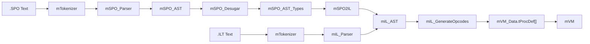
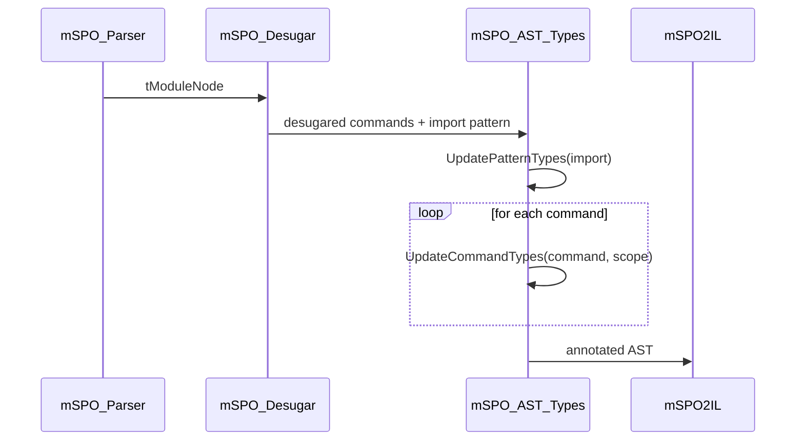

# Compilation Pipeline

## Two Input Paths, One Backend Boundary



`.SPO` and `.ILT` use the same lexer and meet afterward in
`mIL_AST.tModule`.

## 1. Tokenization

`mTokenizer` is the shared lexer for both frontends.

Key facts from the code:

- reserved special characters live in `ReservedChars`
- `#` and `§` create `SpecialId` tokens
- string literals can be single-line or multi-line
- char literals are currently limited to alphanumeric single characters
- identifiers may contain `...`, which is how operator-style names are formed

Both the SPO parser and the IL parser operate on `mTokenizer.tToken`.

## 2. SPO Parsing

`mSPO_Parser` builds the richer surface AST in `mSPO_AST`.

The SPO frontend knows, among other things:

- modules with `§IMPORT`, commands, and `§EXPORT`
- patterns, typed patterns, and guard patterns
- lambdas and methods
- `§IF`, `§IF ... MATCH`, `§IS`
- tuples, pairs, prefix/tag values, and records
- mutable values via `§VAR` and `§TO_VAL`
- type literals as normal expressions
- pipe syntax in both directions

The parser defaults a missing `§IMPORT` section to an empty record pattern.
`§EXPORT` remains mandatory.

## 3. Desugaring

`mSPO_Desugar` reduces the surface language to a smaller core.

Important rewrites:

- tuple expressions and tuple patterns become nested pairs
- text literals become char lists via `#_Char... <int>`
- `expr §IS pattern` becomes `§IF expr MATCH { pattern: §TRUE; _: §FALSE }`
- pipe expressions are reordered into normal call chains
- tuple types are desugared into pair types

Not everything is normalized equally:

- `DesugarType` actively handles only tuple types today
- many other type nodes are currently passed through unchanged

## 4. Type Analysis and Scope Construction

`mSPO_AST_Types` annotates expressions and patterns directly in the AST with `mVM_Type.tType`.



Type analysis does three things at the same time:

- it computes types for expressions
- it binds new names into scope through patterns
- it checks contracts such as `if` conditions or method arguments
- it does not start with an empty scope in the interpreter, but with a built-in `_=...` proc for `§VAR` assignments inside method-call chains

Important semantics:

- block types are the union of all possible `§RETURN` results
- `Call` uses `mVM_Type.Infer(...)`
- `IfMatch` propagates the matched value type into each case
- `VarToVal` explicitly requires a `[§VAR T]` type

## 5. Module Wrapper and Lowering to IL

`mSPO2IL.MapModule(...)` does not translate a SPO module directly into a def list. It first builds a synthetic initialization lambda:

```text
ImportPattern => {
	Commands
	RETURN ExportExpression
}
```

That lambda is type-checked once more and then lowered into IL.

The lowering step produces:

- a type-definition block for `mIL_AST`
- a list of `§DEF` blocks
- explicit register IDs (`r_*`) and def IDs (`d_*`)
- helper procedures for lambdas, methods, recursion, and pattern matching

Important for matches:

- `mSPO2IL` compiles cases into helper functions
- successful matches are internally encoded via a `#Result ...` prefix
- failure is transported as `()`

## 6. IL AST and Text Form

`mIL_AST` is the shared boundary for:

- IL generated from `.SPO`
- directly parsed `.ILT`

`mSPO_Parser.Module.ParseText(...).ToILT()` is the practical helper path for:

- regression artifacts under `SPO_CS/Regression.Tests/*.ILT`
- the `.SPO` vs `.ILT` comparison inside `mModule.Init(...)`
- canonical renumbering to textual `t_*` and `d_*` IDs before writing IL text

The text form always starts with `§TYPES` and is followed by one or more `§DEF` sections.

## 6a. SPO Notation and IL Notation Are Not Identical

When reading `.SPO` and `.ILT`, it is important to note that not only the format changes, but also some keywords:

| Meaning | SPO | IL |
| --- | --- | --- |
| recursive type | `§RECURSIVE` | `§REC` |
| generic type | `§GENERIC` | `§ALL` |
| interface type | `§INTERFACE` | `§ANY` |

This is not a cosmetic side detail, but a real architectural boundary:

- `mSPO_Parser` builds the richer surface AST
- `mSPO2IL` then serializes into the more compact IL notation
- `mIL_Parser` only reads that IL notation back in

Additional observations from the code:

- the parsed-module `ToILT()` helper currently lives in `mSPO_Interpreter`, not in `mSPO_Parser`
- that helper is practical today, but it still couples parsing, desugaring, type analysis, and lowering more tightly than necessary
- debug output introduces a third internal notation through `mVM_Type.ToText(...)`, for example interface types as `§LET ... IN ...` and generics as `[t => T]`

## 7. IL to Opcodes

`mIL_GenerateOpcodes.GenerateOpcodes(...)` translates IL into:

- `mVM_Data.tProcDef<tPos>` for each definition
- concrete register indices
- concrete `mVM_Data.tOpCode` instructions

At the same time, it checks type-safety constraints through `mVM_Type`, such as:

- call arguments
- result types of `§RETURN`
- the shape of `TRY_AS_*` commands
- var set/get contracts

## 8. Hand-off to the VM

At this point the frontend and IL layers are finished. The remaining work is runtime execution over `mVM_Data.tData`, no longer AST or source text.

`mVM.Run(...)` has two relevant modes:

- execution of an IL module
- execution of an already materialized proc or extern proc

For module execution there is an additional fixed startup contract:

- `mIL_GenerateOpcodes` returns a def list in module order
- the last def is executed as the init proc
- all earlier defs are packed into `ENV` as a `Def` tuple
- the resolved import record is passed in as `ARG`
- `OBJ` starts as `()`

The runtime-side details are documented in [31_vm_and_modules.md](../30_runtime/31_vm_and_modules.md).

That completes the pipeline:

1. Read text
2. Tokenize
3. Optionally parse SPO into AST
4. Desugar
5. Type-check
6. Lower to IL
7. Turn IL into opcodes and `tProcDef`
8. Execute in the register-based VM
