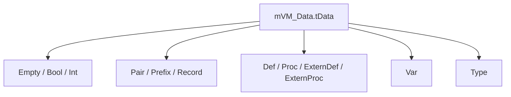
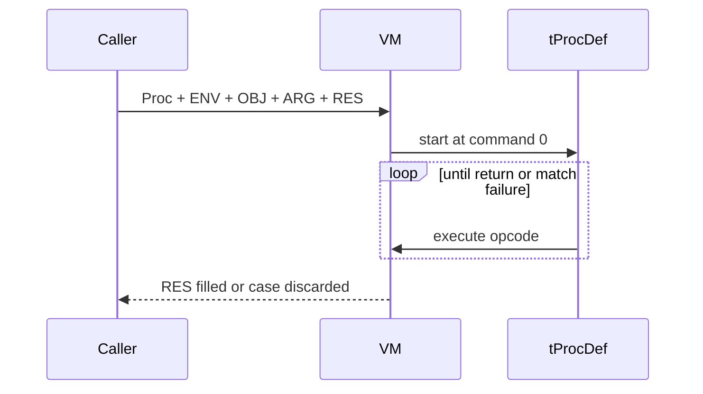

# VM and Modules

## Value Model

`mVM_Data.tData` is the only runtime representation.

The data kinds currently used are:

- `Empty`
- `Bool`
- `Int`
- `Pair`
- `Prefix`
- `Record`
- `Proc`
- `ExternProc`
- `Def`
- `ExternDef`
- `Var`
- `Type`

Important architectural decision:

- The language models complex values mostly through `Pair`, `Prefix`, and `Record`.
- Tuples are only sugar over pairs.
- Text values are runtime-level recursive char lists.

## Register Contract

Every call stack starts with a fixed register layout.

| Index | Meaning | Source |
| --- | --- | --- |
| `0` | `EMPTY` | fixed runtime value |
| `1` | `ONE` | helper value for integer arithmetic |
| `2` | `FALSE` | boolean constant |
| `3` | `TRUE` | boolean constant |
| `4` | `EMPTY_TYPE` | type value |
| `5` | `BOOL_TYPE` | type value |
| `6` | `INT_TYPE` | type value |
| `7` | `TYPE_TYPE` | type value |
| `8` | `ENV` | proc environment |
| `9` | `OBJ` | object for method calls |
| `10` | `ARG` | argument |
| `11` | `RES` | result slot |

This layout is created in `mVM.NewCallStack(...)` and assumed by `mIL_GenerateOpcodes`.

## Module Startup in the VM

`mVM.Run(mIL_AST.tModule, ...)` starts a module using a fixed contract:

- `mIL_GenerateOpcodes.GenerateOpcodes(...)` produces an ordered list of `tProcDef`
- the last def is the module initializer
- all earlier defs are packed into `ENV` as a `Def` tuple
- the resolved import record is placed into `ARG`
- `OBJ` is always `()` when a module starts

This matters because module code can reach earlier defs through `ENV`, while external imports stay clearly separated in `ARG`.

## Proc, Def, and Call Model

Important differences:

- `Def` is an unbound definition
- `Proc` is a definition plus environment
- `ExternDef` and `ExternProc` allow host functions without IL
- `CallFunc` invokes functions without an object; when given a `Def`, it first materializes a `Proc` by binding the passed argument as new environment
- `CallProc` invokes methods with `(Obj, Proc)` pairs and stores the object in register `OBJ`

`ReturnIf` writes into the fixed result register `RES` and ends the current stack frame.

## Pattern Matching in the Runtime

The actual match semantics are already prepared during lowering.
The implementation currently splits into two layers that should not be confused:

- opcodes defined in IL / opcode generation:
  `TryAsEmpty`, `TryAsBool`, `TryAsInt`, `TryAsType`, `TryAsPair`, `TryAsRecord`, `TryAsVar`, `TryAsRef`, `TryRemovePrefixFrom`
- opcodes actually executed in `mVM.Step(...)` today:
  `TryAsEmpty`, `TryAsBool`, `TryAsInt`, `TryAsPair`, `TryAsRecord`, `TryAsVar`, `TryRemovePrefixFrom`

If such a test fails, `mVM.Step(...)` ends the current helper frame and signals "case does not match".

Current gap:

- `TryAsType` is parsed by `mIL_Parser`, represented in `mIL_AST`, and emitted by `mIL_GenerateOpcodes`, but `mVM.Step(...)` has no case for it yet
- `TryAsRef` has the same problem, and `mVM_Data.tDataType` currently has no `Ref` runtime value kind at all

## Type Values at Runtime

The VM can also move `Type` data around, but this area currently has a real three-layer gap:

- `mVM_Data.tOpCode` defines a wider family of runtime type constructors:
  `TypeEmpty`, `TypeAny`, `TypeInt`, `TypeFree`, `TypePair`, `TypePrefix`, `TypeRecord`, `TypeVar`, `TypeSet`, `TypeCond`, `TypeFunc`, `TypeMeth`, `TypeRecursive`, `TypeInterface`, `TypeGeneric`
- `mIL_GenerateOpcodes` can already emit runtime type-building commands for `TypeFunc`, `TypeMethod`, `TypePair`, `TypePrefix`, `TypeSet`, `TypeVar`, `TypeFree`, `TypeRecursive`, `TypeInterface`, and `TypeGeneric`
- `mVM.Step(...)` currently executes only `TypeFree`, `TypePair`, `TypeSet`, `TypeRecursive`, and `TypeGeneric`

That means the VM still falls through to its default `TODO` path if execution reaches `TypeEmpty`, `TypeAny`, `TypeInt`, `TypePrefix`, `TypeRecord`, `TypeVar`, `TypeFunc`, `TypeMeth`, or `TypeInterface`.

Fixed call-stack type constants remain available through registers:

- `EMPTY_TYPE`
- `BOOL_TYPE`
- `INT_TYPE`
- `TYPE_TYPE`

`TypeCond` is an additional special case: the IL generator still throws before it can hand that operation to the VM at all.

That means compile-time type work is more mature than runtime type evaluation, and the drift is not only conceptual: enum definitions, IL generation, and VM execution are currently out of sync.

## Modules Registered in Code

`mModule.cs` currently exposes:

- `Module_Std` from `SPO_CS/Modules/Std.ILT`
- `Module_Char` from `SPO_CS/Modules/Char.SPO`, depending on `Std`
- `Module_Text` from `SPO_CS/Modules/Text.SPO`, depending on `Std` and `Char`
- `Module_Maybe` from `SPO_CS/Modules/Maybe.SPO`

The `Modules/` folder contains more artifacts than the registry exposes:

- `Std.ILT`
- `Char.SPO` and `Char.ILT`
- `Text.SPO` and `Text.ILT`
- `Maybe.SPO` and `Maybe.ILT`
- `Result.SPO`

Only the four `Module_*` values above are addressable through `mModule` today.

As of `2026-04-22`:

- `Std`, `Char`, and `Text` pass `mModule_Tests`
- `Maybe` fails in the module test at generic type application

## Observable Module Semantics

The module tests show the current runtime effect clearly:

- `Std` provides arithmetic and boolean core operations
- `Char` builds character comparison and character functions on top of that
- `Text` builds recursive text functions on top of `Char`
- `Maybe` is present in the filesystem, but is not yet stable across the module boundary

## Host Embedding Example

Outside `SPO_CS/`, `SPO/src/Program.cs` shows how the runtime is embedded by a host application:

- it initializes `Module_Std`
- it exposes `_StdLib` as imported runtime data
- it exposes `_LoadModule...` as an `ExternProc`
- it expects the loaded SPO program to produce a callable value that is then executed with object `#IO ()`

That example is the clearest source-backed reference for how SPO code is meant to cross the host/runtime boundary today.
