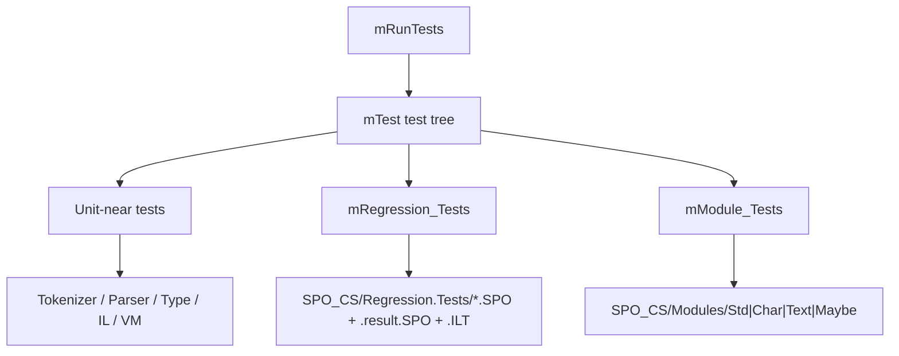

# Tests and Artifacts

## Test Host

`SPO_CS/src/mRunTests.cs` is the central CLI entry point.

## Verified Run Baseline

These commands are the fastest way to re-establish the current test picture from a clean terminal:

| Workdir | Command | Current observed result |
| --- | --- | --- |
| `SPO_CS/` | `dotnet run --project .\SPO_CS.csproj -- --plainText` | `393` leaf checks, `1` failing leaf check (`mModule_Tests -> Maybe`) |
| `SPO_CS/` | `dotnet run --project .\SPO_CS.csproj -- --plainText --matchAll mModule_Tests Maybe` | fails at `.tMaybe tIn` with `expected generic type but '_tMaybe...'` |
| `SPO_CS/` | `dotnet run --project .\SPO_CS.csproj -- --plainText --showPassedGroups --showPassedTests --stopOnFirstFail --matchAny 07_12_GenericTypes` | `3` leaf checks pass |
| repo root | `dotnet run --project .\SPO_CS\SPO_CS.csproj -- --plainText` | `246` leaf checks, `1` failing leaf check, plus `Folder not found: mFS+tFolder` |

These results were rechecked on `2026-04-22`.

Important flags and behaviors from the code:

- `--help` / `-h`
- `--list` / `-l`
- `--matchAny` / `-m`
- `--matchAll` / `-M`
- `--plainText` / `-p`
- `--stopOnFirstFail`
- `--showPassedGroups` / `-g`
- `--showPassedTests` / `-t`
- `--showSkippedTests` / `-s`
- `--outputLevel` / `-o`
- `--treeLevel`
- `--debugger` / `-D`
- `--debugId`

Important caveats visible in `mRunTests.cs`:

- `--matchAll` and `--matchAny` must be the last flag pair because they consume every remaining argument as filter text
- the short flags for depth and debug id are distinct:
  `-d` is `--treeLevel`, `-i` is `--debugId`
- `--plainText` is also forced automatically when stdout is redirected
- the code also accepts numeric aliases such as `-1`, `-2`, ... for stopping after a limited number of failures, but for documentation and scripts the long `--stopOnFirstFail` form is clearer
- the numeric aliases are not perfectly regular: `-8` currently maps to `7` and `-9` to `8`, so they are best treated as legacy shortcuts
- the file-driven regression suite is current-working-directory-sensitive because `mRegression_Tests` resolves `Regression.Tests/` from `mFS.CWD()`

The test host starts the root group `All`, which is assembled in `SPO_CS/src/mRunTests.cs` from `mCommon_Tests.Tests` and `mSPO_Tests.Tests`.

## Test Layers



## Suite Composition

`mSPO_Tests.Tests` currently includes these main groups:

- `mTokenizer_Tests`
- `mIL_Parser_Tests`
- `mIL_GenerateOpcodes_Tests`
- `mVM_Type_Tests`
- `mVM_Tests`
- `mSPO_AST_Types_Tests`
- `mSPO_Parser_Tests`
- `mSPO2IL_Tests`
- `mRegression_Tests`
- `mModule_Tests`

That means the architecture is secured not only by unit tests, but also by complete file-driven runs.

## Regression Harness

`mRegression_Tests` reads, for each case under `SPO_CS/Regression.Tests/`:

- `Name.SPO`
- `Name.result.SPO`
- `Name.ILT`

Each case produces exactly three checks:

1. `.SPO == .result.SPO`
2. `.SPO -> .ILT`
3. `.ILT == .result.SPO`

This tests three distinct contracts:

- direct SPO interpretation is semantically correct
- lowering to IL is stable
- IL execution is semantically equivalent to SPO execution

Important execution details from the code:

- the `.SPO` file under test and the `.ILT` file both run with `Module_Std` as import
- the oracle file `.result.SPO` runs with an empty import and must carry its expected semantics itself
- discovery uses `mFS.CWD() / "Regression.Tests"`, so `mRunTests` has to be launched from `SPO_CS/` for this suite to appear at all
- only files whose names literally end in `.SPO` are discovered as regression sources, so sibling scratch files such as `07_13_HigherOrderFuncTypes.SPO_Fail` are not part of the harness
- files named `_*.SPO` are intentionally skipped by the harness
- when the folder is missing, the current warning is low-signal:
  `Folder not found: mFS+tFolder`

If the generated IL text differs from the stored `.ILT`, the harness writes `Name.ILT.new`.

As checked on `2026-04-22`, that folder currently yields `49` discovered regression source files, which means `147` file-driven regression checks before the rest of the unit and module suites are counted.

## Module Tests

`mModule_Tests` exercises real library modules through `mModule.Init(...)`.

Currently covered:

- `Std`
- `Char`
- `Text`
- `Maybe`

Observed state on `2026-04-22`:

- `Std`, `Char`, and `Text` are green
- `Maybe` is red because of generic type application over `.tMaybe tIn`

## Real Checks Run for This Documentation

```powershell
Push-Location .\SPO_CS
dotnet run --project .\SPO_CS.csproj -- --list --plainText
dotnet run --project .\SPO_CS.csproj -- --plainText --stopOnFirstFail --matchAny mModule_Tests
dotnet run --project .\SPO_CS.csproj -- --plainText --showPassedGroups --showPassedTests --stopOnFirstFail --matchAny 07_12_GenericTypes
Pop-Location
```

Run these checks sequentially. Parallel `dotnet run` invocations against the same project can contend for `bin/Debug/net10.0/SPO_CS.exe` or `obj/Debug/net10.0/SPO_CS.dll`. After one successful build, the follow-up checks can be rerun with `--no-build`.

These commands currently build with several compiler / analyzer warnings. The verified facts in this file refer to test behavior and exit status, not to a warning-free build.

Summary:

- the full suite is currently red only because `mModule_Tests -> Maybe` still fails
- the test tree is consistent and can be listed completely when the current working directory is `SPO_CS/`
- the module loader is reliable for `Std`, `Char`, and `Text`
- the generics regression case `07_12_GenericTypes` passes end-to-end
- the module loader for `Maybe` marks a real system boundary, not a documentation guess

## Important Repository Artifacts

| Location | Role |
| --- | --- |
| `SPO_CS/Modules/*.SPO` | source modules |
| `SPO_CS/Modules/*.ILT` | canonical compiled module forms |
| `SPO_CS/Regression.Tests/*.SPO` | inputs for end-to-end scenarios |
| `SPO_CS/Regression.Tests/*.result.SPO` | expected semantics expressed as SPO |
| `SPO_CS/Regression.Tests/*.ILT` | expected IL lowering |
| `SPO_CS/**/*.ILT.new` | drift indicator between current and canonical IL |

## Why This Test Structure Is Architecturally Strong

It covers exactly the places where this repository is most likely to drift:

- text syntax
- desugaring
- type analysis
- lowering
- IL stability
- VM execution
- module initialization
