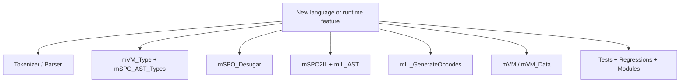

# Known Limits and Extension Points

This file documents no theoretical risks, only limits that are directly visible in the current code or in verified tests.

The prioritized implementation order for those limits is documented in [43_next_work.md](43_next_work.md).

## Verified Limits

| Area | State in code | Practical impact |
| --- | --- | --- |
| Conditional types | `mVM_Type.Cond(...)`, `IsCond(...)`, and `mIL_GenerateOpcodes` for `TypeCond` are unfinished | `TypeCond` exists syntactically, but not as a robust end-to-end feature |
| Runtime type values | `mVM_Data.tOpCode`, `mIL_GenerateOpcodes`, and `mVM.Step(...)` are not aligned: the VM executes only `TypeFree`, `TypePair`, `TypeSet`, `TypeRecursive`, and `TypeGeneric`, while the generator already handles more cases and still throws on `TypeCond` | type expressions as runtime values are only partially reliable |
| Runtime match opcodes | `mIL_AST`, `mIL_Parser`, and `mIL_GenerateOpcodes` all expose `TryAsType` and `TryAsRef`, but `mVM.Step(...)` has no execution case for either one, and `mVM_Data.tDataType` has no `Ref` value kind | IL/runtime matching support is broader on paper than it is in the executing VM |
| Generic type application across modules | `mModule_Tests.Maybe` fails at `.tMaybe tIn` while `mModule.Init(...)` is still compiling `Modules/Maybe.SPO` through `mSPO_Parser.Module.ParseText(...).ToILT()` and `mSPO_AST_Types.AsVM_Type(GenericApplyType)` | successful generic support in regressions does not yet mean stable module libraries, and this specific failure is earlier than IL execution or VM runtime |
| Regression test discovery | `mRegression_Tests` resolves `Regression.Tests` through `mFS.CWD()` and prints `Folder not found: mFS+tFolder` on a miss | running `mRunTests` from the repo root silently drops the regression suite unless the current working directory is changed to `SPO_CS/` first |
| Subtyping | `mVM_Type.IsSubType(...)` still throws `NotImplementedException` for `Any`, `Var`, `Ref`, and `Cond` | parts of the type system are parseable more broadly than they are actually decidable |
| Recursive proc materialization | `mVM.Step(...)` currently uses `Count = 1` for `DefRecProcs` | mutual recursion between multiple values remains a risk area |
| Prefix/field keys | prefixes and record fields are mapped to `tNat32` via `PrefixHash()` | theoretical hash collisions are not yet ruled out |
| Type desugaring | `mSPO_Desugar.DesugarType(...)` actively normalizes only tuple types | some type forms survive in their surface shape deep into the backend |

## What the Tests Already Cover Cleanly

- parser and printer for IL commands and IL type commands
- SPO end-to-end for literals, records, match, recursion, and `§VAR`
- recursive and generic type syntax in regressions
- library modules `Std`, `Char`, and `Text`

## What Is Documented Cautiously on Purpose

The following language and architecture forms are visible in the code, but
should not be understood as broadly secured "finished features":

- `§INTERFACE` type syntax
- runtime evaluation of all type literals
- runtime execution of every emitted match opcode
- multi-proc recursive groups as runtime values
- generic library modules with type application across module boundaries

## Highest-Value Clarification

The current `Maybe` failure is important because it narrows the problem more
than the short error message suggests:

- verified fact: `07_12_GenericTypes` passes all three regression checks
- verified fact: `mModule_Tests.Maybe` fails in `Modules/Maybe.SPO` at `.tMaybe tIn`
- verified fact: that failure is raised during the `.SPO -> .ILT` validation path before the module reaches `mVM.Run(...)`

Inference from the source and error text, to verify during implementation:

- because the failing code path is `mSPO_AST_Types.AsVM_Type(GenericApplyType)` and the message prints `_tMaybe...`, the immediate issue is likely in how named generic type constructors are resolved or materialized during module compilation, not in opcode execution

## Concrete Extension Path

In this repository, a feature only truly exists once all affected layers have been carried through:

1. Syntax
2. Type analysis
3. Lowering
4. Opcode generation
5. VM execution
6. Regression or module tests

For type-related features there is an additional practical rule: verify the opcode enum, the IL generator, and `mVM.Step(...)` together. In the current codebase those three layers do not automatically move in lockstep.

## Recommended Order for Extensions

### 1. Stabilize Generic Modules

The reproducible `Maybe` gap is the best concrete place to harden generics across library boundaries.

### 2. Complete the Type System

If `Any`, `Var`, `Ref`, or `Cond` should be presented as frontend features, then `mVM_Type.IsSubType(...)` needs a robust implementation first.

### 3. Close the Runtime Type-Value Gap

If type literals are supposed to be exportable or manipulable as runtime data, the missing `Type*` cases in `mVM.Step(...)` need to be completed.

### 4. Harden Recursion and Prefix Identity

Multi-recursion and hash-based prefixes are currently the two clearest runtime risk areas below the language surface.

### 5. Make Verification Less CWD-Sensitive

The regression harness should resolve its fixture folder from a stable project anchor instead of `mFS.CWD()`, and its missing-folder warning should print the resolved path rather than the type name `mFS+tFolder`.

## Good Extension Points in Code

- `mSPO_Parser`
  when new surface syntax is added
- `mSPO_Desugar`
  when sugar should be reduced to existing core forms
- `mSPO_AST_Types`
  when new scope or type rules are needed
- `mSPO2IL`
  when a feature exists in the AST but does not yet reach IL
- `mIL_GenerateOpcodes`
  when IL already exists but still has no VM operation
- `mVM`
  when runtime behavior or new type opcodes are missing
- `mRegression_Tests` and `mModule_Tests`
  when a feature should be secured with real artifacts
