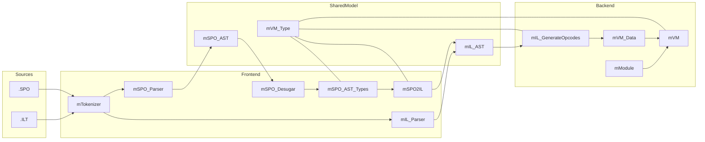

# SPO Architecture Map

This folder is secondary documentation. It is laid out in the same order you usually need when reading the repository:

1. repo shape and entry points
2. surface language
3. lowering and backend boundary
4. VM and module loading
5. tests, limits, and next work

Primary sources still remain:

- [SPO_CS/src/](../SPO_CS/src/)
- [SPO_CS/Modules/](../SPO_CS/Modules/)
- [SPO_CS/Regression.Tests/](../SPO_CS/Regression.Tests/)
- [SPO_CS/SPO_CS.csproj](../SPO_CS/SPO_CS.csproj)

Complementary review documents live in [AI-Review/](../AI-Review/README.md).

Treat this folder as a reading aid, not as the authority. When a claim matters, confirm it against the source tree and the test host.

## How To Use This Folder Safely

- Start here for code-map and pipeline orientation, not for final debugging decisions.
- Use [AI-Review/](../AI-Review/README.md) for prioritized findings and active breakage.
- When a statement affects implementation work, re-check it against source and one of the verification commands below before repeating it elsewhere.
- When you update this folder, update the affected evidence in the same pass: source anchors, commands, and current observed behavior.

Path convention for this folder:

- bare prose paths like `src/`, `Modules/`, and `Regression.Tests/` refer to `SPO_CS/src/`, `SPO_CS/Modules/`, and `SPO_CS/Regression.Tests/`
- runnable commands below assume the current working directory is `SPO_CS/` because `mRegression_Tests` resolves `Regression.Tests/` through `mFS.CWD()`
- from the repo root next to `AI-Doc/`, use `Push-Location .\SPO_CS` first

If you inspect these files from Windows PowerShell, prefer `Get-Content -Encoding UTF8` so `§` and `€` render correctly.

This index was checked on `2026-04-22` against the current source tree and these test commands:

```powershell
Push-Location .\SPO_CS
dotnet run --project .\SPO_CS.csproj -- --list --plainText
dotnet run --project .\SPO_CS.csproj -- --plainText --stopOnFirstFail --matchAny mModule_Tests
dotnet run --project .\SPO_CS.csproj -- --plainText --showPassedGroups --showPassedTests --stopOnFirstFail --matchAny 07_12_GenericTypes
Pop-Location
```

Run those checks sequentially. Parallel `dotnet run` invocations against the same project can lock `bin/Debug/net10.0/SPO_CS.exe` or `obj/Debug/net10.0/SPO_CS.dll`. After one successful build, the targeted checks above can be repeated with `--no-build`.

Operational caveat:

- keep `--matchAny` and `--matchAll` last; `mRunTests.cs` treats every remaining argument as filter text
- running from the repo root without changing into `SPO_CS/` currently prints `Folder not found: mFS+tFolder` and silently drops the regression suite from discovery

Current verified state:

- full suite from `SPO_CS/`: `393` leaf checks, `1` failing leaf check (`mModule_Tests -> Maybe`)
- repo-root run via `dotnet run --project .\SPO_CS\SPO_CS.csproj -- --plainText`: `246` leaf checks, `1` failing leaf check, plus `Folder not found: mFS+tFolder`
- the full test tree lists successfully when launched from `SPO_CS/`
- `Std`, `Char`, and `Text` pass `mModule_Tests`
- `Maybe` still fails reproducibly with `expected generic type but '_tMaybe...'`
- regression `07_12_GenericTypes` still passes all three regression checks
- `.SPO` modules are compared against sibling `.ILT` artifacts and write `.ILT.new` on drift
- the current `Maybe` failure is reached before VM execution:
  `mModule.Init(...)` first calls `mSPO_Parser.Module.ParseText(...).ToILT()`, where `ToILT()` is the parsed-module extension currently defined in `mSPO_Interpreter`, and the failing source location is `SPO_CS/Modules/Maybe.SPO` line 7 at `.tMaybe tIn`

## Highest-Priority Breakage

The most important current limitation is not "generics are broken" in general, but a narrower module-compilation boundary:

- regression `07_12_GenericTypes` proves that generic syntax, lowering, and IL execution still work for at least one end-to-end path
- `mModule_Tests.Maybe` fails earlier, while compiling `Modules/Maybe.SPO` through `mSPO_Parser.Module.ParseText(...).ToILT()` and `mSPO_AST_Types`
- the concrete failing expression is `.tMaybe tIn` in [SPO_CS/Modules/Maybe.SPO](../SPO_CS/Modules/Maybe.SPO)
- the concrete failure site in code is the generic-application case in [SPO_CS/src/mSPO_AST_Types.cs](../SPO_CS/src/mSPO_AST_Types.cs), which rejects the head type with `expected generic type but '_tMaybe...'`

Why this matters for triage:

- do not start by changing `mVM`, `mVM_Data`, or `mIL_GenerateOpcodes` for this failure
- first inspect module-source type analysis and type-constructor resolution in `mSPO_AST_Types`, plus the parsed-module `.ToILT()` helper in [SPO_CS/src/mSPO_Interpreter.cs](../SPO_CS/src/mSPO_Interpreter.cs) and the `.SPO -> .ILT` verification path in [SPO_CS/src/mModule.cs](../SPO_CS/src/mModule.cs)
- only if the failure moves past type analysis should the runtime documents in `30_runtime/` become the next debugging layer

## High-Value Source Anchors

When this folder and the code disagree, re-check these files first:

- [SPO_CS/src/mSPO_Interpreter.cs](../SPO_CS/src/mSPO_Interpreter.cs)
  full SPO pipeline entry point, parsed-module `ToILT()` helper, initial scope seeding, and final error shaping
- [SPO_CS/src/mModule.cs](../SPO_CS/src/mModule.cs)
  module dependency injection, `.SPO` vs `.ILT` loading, and `.ILT` drift checks
- [SPO_CS/src/mIL_GenerateOpcodes.cs](../SPO_CS/src/mIL_GenerateOpcodes.cs)
  the actual boundary where IL becomes VM opcodes and runtime type operations
- [SPO_CS/src/mVM.cs](../SPO_CS/src/mVM.cs)
  fixed registers, opcode execution, and the real runtime support surface
- [SPO_CS/src/mRunTests.cs](../SPO_CS/src/mRunTests.cs)
  authoritative CLI flag behavior for listing, filtering, and printing tests
- [SPO_CS/src/mRegression.Tests.cs](../SPO_CS/src/mRegression.Tests.cs) and [SPO_CS/src/mModule.Tests.cs](../SPO_CS/src/mModule.Tests.cs)
  the executable contracts this folder claims to summarize

## Refreshing This Folder

When parser, lowering, type, VM, or module code changes, update this folder in this order:

1. Re-run the checks listed above.
2. Re-open the source anchors for the area you changed.
3. For type-runtime changes, inspect all three layers before editing docs:
   `mVM_Data.tOpCode`, `mIL_GenerateOpcodes.GenerateOpcodes(...)`, and `mVM.Step(...)`.
4. Only then update the affected `AI-Doc` file, keeping verified behavior and unimplemented behavior clearly separated.

## Folder Layout

```text
AI-Doc/
  README.md
  00_start_here/
    01_repo_overview.md
    02_code_map.md
    03_supporting_projects.md
  10_language/
    11_surface_language.md
  20_pipeline/
    21_compilation_pipeline.md
  30_runtime/
    31_vm_and_modules.md
  40_verification/
    41_tests_and_artifacts.md
    42_known_limits_and_extension_points.md
    43_next_work.md
```

### 00 Start Here

- [01_repo_overview.md](00_start_here/01_repo_overview.md)
  Project scope, entry points, artifacts, and architectural contracts.
- [02_code_map.md](00_start_here/02_code_map.md)
  Where the important source files live and how they depend on each other.
- [03_supporting_projects.md](00_start_here/03_supporting_projects.md)
  Repo satellites outside `SPO_CS/`: sample host app, editor tooling, and the custom test adapter.

### 10 Language

- [11_surface_language.md](10_language/11_surface_language.md)
  The SPO surface language, the IL-facing naming boundary, and real examples.

### 20 Pipeline

- [21_compilation_pipeline.md](20_pipeline/21_compilation_pipeline.md)
  How `.SPO` and `.ILT` converge on `mIL_AST.tModule` and hand off to the VM.

### 30 Runtime

- [31_vm_and_modules.md](30_runtime/31_vm_and_modules.md)
  Runtime value model, fixed registers, module loading, and module status.

### 40 Verification

- [41_tests_and_artifacts.md](40_verification/41_tests_and_artifacts.md)
  Test host, regression harness, module tests, and generated artifacts.
- [42_known_limits_and_extension_points.md](40_verification/42_known_limits_and_extension_points.md)
  Verified system gaps and where to extend the implementation safely.
- [43_next_work.md](40_verification/43_next_work.md)
  Prioritized follow-up work derived from code and reproducible failures.

## Read By Goal

- Want the quickest repo orientation:
  [01_repo_overview.md](00_start_here/01_repo_overview.md) ->
  [02_code_map.md](00_start_here/02_code_map.md)
- Need the non-compiler folders that still affect day-to-day work:
  [03_supporting_projects.md](00_start_here/03_supporting_projects.md)
- Want the SPO and IL mental model:
  [11_surface_language.md](10_language/11_surface_language.md) ->
  [21_compilation_pipeline.md](20_pipeline/21_compilation_pipeline.md) ->
  [31_vm_and_modules.md](30_runtime/31_vm_and_modules.md)
- Want confidence, risks, and next engineering work:
  [41_tests_and_artifacts.md](40_verification/41_tests_and_artifacts.md) ->
  [42_known_limits_and_extension_points.md](40_verification/42_known_limits_and_extension_points.md) ->
  [43_next_work.md](40_verification/43_next_work.md)

## Big Picture



## Linear Reading Order

[01_repo_overview.md](00_start_here/01_repo_overview.md)
[02_code_map.md](00_start_here/02_code_map.md)
[03_supporting_projects.md](00_start_here/03_supporting_projects.md)
[11_surface_language.md](10_language/11_surface_language.md)
[21_compilation_pipeline.md](20_pipeline/21_compilation_pipeline.md)
[31_vm_and_modules.md](30_runtime/31_vm_and_modules.md)
[41_tests_and_artifacts.md](40_verification/41_tests_and_artifacts.md)
[42_known_limits_and_extension_points.md](40_verification/42_known_limits_and_extension_points.md)
[43_next_work.md](40_verification/43_next_work.md)

## Architecture Invariants

- `SPO_CS/SPO_CS.csproj` builds one `net10.0` executable that contains production code and tests together.
- `.SPO` and `.ILT` meet architecturally in `mIL_AST.tModule`.
- `mTokenizer` is shared by both frontends.
- `mVM_Type` is shared by parsing, type analysis, lowering, opcode generation, and the VM.
- a SPO module is internally turned into an initialization lambda:
  `ImportPattern => { Commands; RETURN Export }`
- `mModule` is both module loader and canonical `.ILT` verification step

## Corrections Pulled Toward the Code

- SPO surface syntax and IL text syntax are intentionally not identical.
  Generic, interface, and recursive type keywords differ across that boundary.
- generics are not globally broken:
  regression `07_12_GenericTypes` passes end-to-end, while `mModule_Tests.Maybe` still fails across the module boundary
- the type system is ahead of runtime type evaluation:
  `mVM_Data` and `mIL_GenerateOpcodes` know more `Type*` cases than `mVM.Step(...)` currently executes
